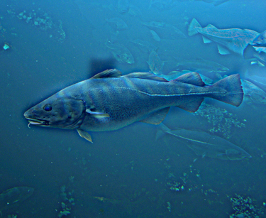
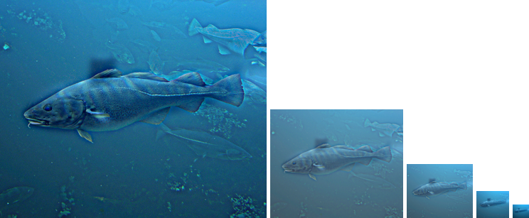

# Image-Filtering-and-Hybrid-Images
Create a image filtering algorithm and generate hybrid images from two distinct images by filtering them with gaussian filter.

## Overview
The project is related to 
> how to create a image filtering algorithm, generating hybrid images from two distinct images by filtering them with gaussian filter.


## Implementation
1. my_imfilter.py
* my_imfilter.py creates the basic image algorithm based on the convolution, and also fixes the boundary problem for convolution by padding technique. First, I splitted RGB channel seperately since the padding method for 3D array was not straight forward for me, while 2D worked much better. I used numpy.pad() to pad the boundary, and the amount of padding depending on the size of filter, therefore, any size of filter should work in this algorithm. After padding, I used two for loop to scan over each pixel, doing convolution with the help of numpy.multiply(), and then used np.sum() to summerize the result of multiply. I noticed that numpy.multiply() provided much faster computing than my original algorithm. In my original code, I used several loops to scan over each point in the filter and the corresponding point in the image, and it took lots of time.
```
R = image[:,:,0]
G = image[:,:,1]
B = image[:,:,2]

H_img = R.shape[0]
W_img = R.shape[1]
H_filter = imfilter.shape[0]
W_filter = imfilter.shape[1]
H_pad = int((H_filter-1)/2)
W_pad = int((W_filter-1)/2)

npad = ((H_pad, H_pad), (W_pad, W_pad))
RGB_pad = []
RGB_pad.append(np.pad(R, pad_width=npad, mode='reflect'))
RGB_pad.append(np.pad(G, pad_width=npad, mode='reflect'))
RGB_pad.append(np.pad(B, pad_width=npad, mode='reflect'))

output = np.zeros_like(R)

for each in RGB_pad:
RGB_new = []
# convolution of whole matrix
for m in range(H_img):
for n in range(W_img):
# convolution in each small matrix
total = 0
total = np.sum(np.multiply(each[m:m+H_filter, n:n+W_filter], imfilter))
RGB_new.append(total)

RGB_new = np.asarray(RGB_new)
RGB_new = RGB_new.reshape(H_img, W_img)

# combine RGB channel into 3D array
output = np.dstack((output, RGB_new))

# remove the zeros array
output = output[:, :, 1:]
```

2. vis_hybrid_image.py
* vis_hybrid_image.py created a better visualization technique for observing hybrid images easily. User can tune the scale_factor to change the downsampling rate and scale to change the amount of image.

3. gauss2D.py
* gauss2D.py created a gaussian filter.


## Installation
* Other required packages?
- numpy
- scipy
- matplotlib
- os

* How to run your code?
- Run proj1.py directly. The default hybrid image used "cat.bmp" and "dog.bmp", user can choose the image they want to use by changing the image path. For example, image1 = mpimg.imread(os.path.join(main_path, 'data', 'dog.bmp')), you just need to change 'dog.bmp' into any image you want.
- image1 is used for low frequencies image, while image2 is used as high frequencies image. Besides, you can tune the "cutoff_frequency_1" for low frequencies image; "cutoff_frequency_2" for high frequencies image. The higher the value, the more blur and clear in low and high frequencies image respectively.
```
cutoff_frequency_1 = 7 
gaussian_filter_1 = gauss2D(shape=(cutoff_frequency_1*4+1,cutoff_frequency_1*4+1), 
sigma = cutoff_frequency_1)
low_frequencies = my_imfilter(image1, gaussian_filter_1)

cutoff_frequency_2 = 7
gaussian_filter_2 = gauss2D(shape=(cutoff_frequency_2*4+1,cutoff_frequency_2*4+1), 
sigma = cutoff_frequency_2)
low_frequencies_2 = my_imfilter(image2, gaussian_filter_2)
high_frequencies = image2 - low_frequencies_2

hybrid_image = low_frequencies + high_frequencies
```


### Results

<table border=1>
<tr>
<td>


</td>
</tr>

<tr>
<td>


</td>
</tr>

<tr>
<td>


</td>
</tr>

<tr>
<td>


</td>
</tr>

<tr>
<td>




</td>
</tr>

<tr>
<td>


</td>
</tr>

<tr>
<td>


</td>
</tr>

</table>

## Credits
This project is modified by Chia-Hung Yuan based on Min Sun, James Hays and Derek Hoiem's previous developed projects 
